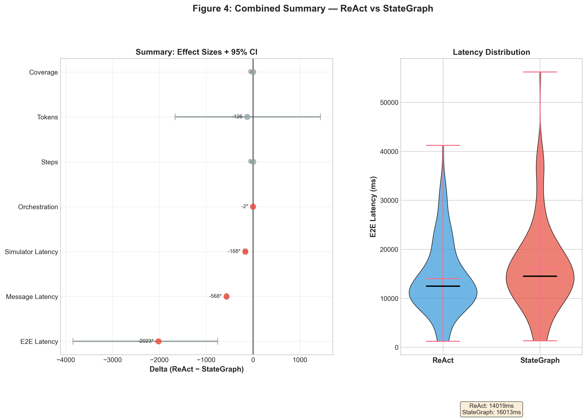

# LangGraph vs. ReAct: Controlled Engineering Benchmark

A controlled comparison of two orchestration strategies for **streaming conversational agents**:

- **ReAct-style cyclic loop**
- **LangGraph StateGraph**

The study isolates orchestration architecture as the only variable across **135 paired runs** (45 scenarios × 3 repetitions).

---

## Key Result



For **short-horizon, linear information-extraction dialogues**:

- **Latency:** ReAct is faster (~2s on average; mean delta: −2023ms, 95% CI: [−3847, −757])
- **Outcome quality:** no statistically significant difference (McNemar p=0.52)
- **Efficiency:** no statistically significant difference in steps (p=0.85) or tokens (p=0.99)

**Interpretation:**  
Orchestration architecture primarily affects **latency**, not outcome quality, in this setting.

**Scope:**
Findings apply to short-horizon, linear slot-filling dialogues and may not generalize to complex or long-running workflows.

---

## Experiment Summary

- **Design:** paired comparison (same scenarios under both strategies)  
- **Scenarios:** 45 simulated doctor–patient dialogues  
- **Runs:** 135 paired executions  
- **Model:** Claude 3 Haiku (AWS Bedrock)  
- **Control:** identical prompts, tools, and simulator  

---

## Full Report

See [`docs/REPORT.md`](docs/REPORT.md) for:

- experimental design  
- metric definitions  
- statistical analysis  
- discussion and limitations  

---

## Usage

### 1. Setup

```bash
uv sync
cp .env.example .env
````

Fill in:

```bash
AWS_ACCESS_KEY_ID=
AWS_SECRET_ACCESS_KEY=
AWS_REGION=us-east-1
```

---

### 2. (Optional) Prepare patient profiles

```bash
uv run python -m src.profiles.build_profiles \
      --comprehend-dir data/raw_comprehend/19_02_2026_1 \
      --dialogues-jsonl data/processed/dialogues_parsed.jsonl \
      --output data/processed/patient_profiles.jsonl
```

---

### 3. Run experiments

Single run:

```bash
uv run python run.py
```

Batch run:

```bash
uv run python run_batch.py --strategy all
```

---

### 4. Generate results

Tables:

```bash
uv run python scripts/generate_results_tables.py
```

Figures:

```bash
uv run python scripts/generate_figures.py
```

---

## Project Structure

```text
src/
├── strategies/         # StateGraph and ReAct implementations
├── simulator/          # Patient response simulation
├── metrics_agregator/  # Metrics collection & aggregation
├── research/           # Experiment logic and orchestration
├── utils/              # AWS / Bedrock integration

data/
├── raw/                # source dialogues
├── raw_comprehend/     # extracted medical entities
├── processed/          # transformed data and profiles
├── output/             # aggregated metrics and logs
```

---

## Data & Availability

* 45 scenarios derived from structured dialogue simulations
* 135 runs (paired comparison across strategies)
* Aggregated metrics available in `data/output/`

**Note:**
Dialogue transcripts are not publicly distributed,
but may be shared upon request.

---

## Reproducibility

All experiments are:

* deterministic at scenario level
* repeated across 3 runs per scenario
* evaluated with bootstrap confidence intervals

Full methodology → see [`docs/REPORT.md`](docs/REPORT.md)

---

## Contributing

This repository is primarily a research artifact.

* Issues and discussions are welcome
* Pull requests may be considered if they improve reproducibility or clarity

---

## License

MIT License — see [`LICENSE`](LICENSE)
