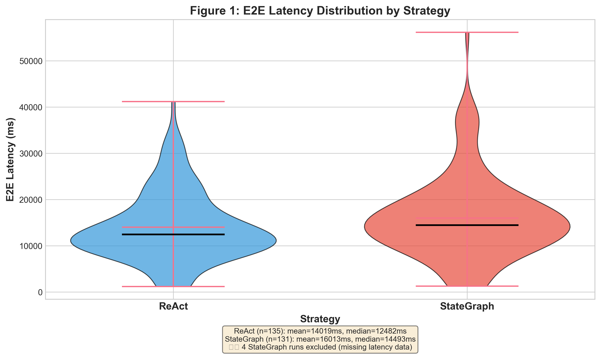
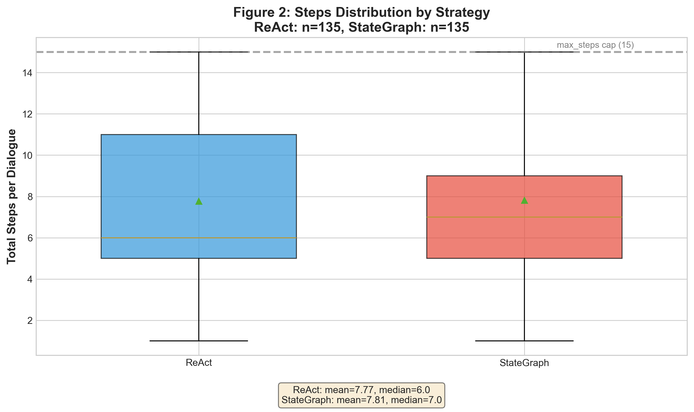
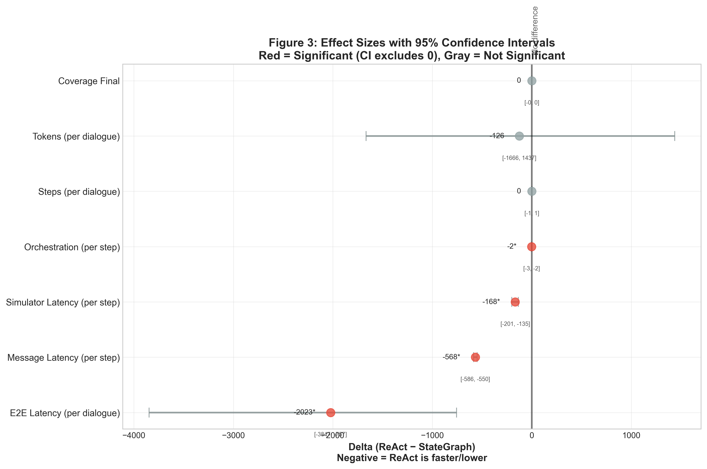

# 04. Results

*Delta = ReAct − StateGraph (negative value indicates ReAct is faster or lower).*

---

## 4.1 Key Findings

This section reports empirical results of the controlled comparison between `ReAct` and `StateGraph` architectures across `45` simulated dialogue scenarios (`135` paired runs).

**Experimental Scope:**

- 45 scenarios
- 3 batches
- 135 paired runs
- same prompts and done conditions
- same simulator
- same LLM

### Summary Statistics

| Metric | ReAct Mean | ReAct Median | StateGraph Mean | StateGraph Median | Delta | 95% CI | p-value | Effect Size |
| ------ | --------- | ----------- | --------------- | ----------------- | ----- | ------ | ------- | ----------- |
| **E2E Latency (per dialogue)** | 14019.29ms | 12482.30ms | 15538.67ms | 14366.77ms | **-2023ms** | [-3847, -757] | 0.05 | -0.21 (small) |
| **Message Latency (per step)** | 963.18ms | 925.94ms | 1553.15ms | 1491.50ms | **-568ms** | [-586, -550] | 8.21e-24 | -0.96 (large) |
| **Simulator Latency (per step)** | 866.00ms | 964.18ms | 1100.32ms | 1121.64ms | **-168ms** | [-201, -135] | 8.48e-18 | -0.78 (large) |
| **Orchestration (per step)** | 0.73ms | 0.54ms | 3.22ms | 2.76ms | **-2ms** | [-3, -2] | 5.66e-21 | -0.98 (large) |
| **Steps (per dialogue)** | 7.77 | 6 | 7.81 | 7 | **0** | [-1, 1] | 0.85 | -0.11 (small) |
| **Tokens (per dialogue)** | 11952 | 8435 | 11676 | 9375 | **-126** | [-1666, 1437] | 0.99 | -0.05 (negligible) |
| **Success Rate** | 83.0% | — | 80% | — | — | — | 0.52 (McNemar) | — |
| **Coverage Final** | 1.10 | 1 | 1.07 | 1 | **0** | [-0.18, +0.22] | 0.59 | -0.01 (negligible) |

**Notes:**

- Values shown: Mean (arithmetic average). For full distributions, see §4.2–4.4.
- All statistics computed over N = 135 paired runs (45 scenarios × 3 batches).
- Effect size (rank-biserial): |r| < 0.1 (negligible), 0.1–0.3 (small), 0.3–0.5 (medium), ≥ 0.5 (large).
- Statistical tests: Wilcoxon signed-rank for continuous metrics, McNemar for success rate.
- 95% CI: If confidence interval includes 0, we cannot reject the null hypothesis (no difference) at 95% confidence level.

**Key Observations:**

1. **ReAct shows ~2s lower E2E latency per dialogue** - driven primarily by differences in message and simulator latency (`~600ms per step` combined), while pure orchestration overhead remains negligible (`~2–3ms` per step). Although ReAct shows lower mean latency, StateGraph wins more individual runs (61%). This pattern is consistent with a right-skewed latency distribution where StateGraph has a longer tail of slow outliers, which increases the mean despite similar medians.
2. **No statistically significant difference in quality** - success rate and coverage are statistically indistinguishable
3. **Same efficiency** - steps and tokens distributions are statistically indistinguishable
4. **Message and simulator latency measurements differ significantly between strategies, though part of the difference may be attributable to measurement boundaries within the orchestration implementation.**

> Note: Latency Overhead is architectural, not from business logic (orchestration ~2ms). For more details see §5.2.

---

## 4.2 Primary Outcome: Latency

### E2E Total Latency per Dialogue

**Delta: −2023ms (95% CI: [−3847, −757])**

ReAct completes dialogues **~2 seconds faster** than StateGraph on average.

| Strategy | Mean (ms) | Median (ms) |
| -------- | --------- | ----------- |
| ReAct | 14019 | 12482 |
| StateGraph | 15539 | 14367 |

**Wilcoxon signed-rank test:** W = 3698.0, p = 0.050 (borderline; interpretation should be treated with caution)

**Win rate:** ReAct wins 53/135 (39%), StateGraph wins 82/135 (61%)

**Rank-biserial correlation:** −0.21 (small effect size, favors ReAct)

**Interpretation:** ReAct shows a small but measurable advantage in end-to-end dialogue completion time. See §5.2 for breakdown of latency components.

---

### Latency Breakdown by Component

#### Message Latency (LLM Call)

**Delta: −568ms per step (95% CI: [−586, −550])**

| Strategy | Mean (ms) | Median (ms) |
| --- | --- | --- |
| ReAct | 963.18 | 925.94 |
| StateGraph | 1553.15 | 1491.50 |

**Wilcoxon signed-rank test:** W = 9.0, p = 8.2×10⁻²⁴ (highly significant)

**Win rate:** ReAct wins 3/135 (2%), StateGraph wins 132/135 (98%)

**Rank-biserial:** −0.96 (very large effect size)

> **Note:** This difference includes both LLM call time and implementation artifacts (validation timing differs between strategies). Latency was measured end-to-end within each step to capture real orchestration overhead, not just pure LLM computation time. See Discussion §5.3 for detailed analysis.

---

#### Simulator Latency (Patient Response)

**Delta: −168ms per step (95% CI: [−201, −135])**

| Strategy | Mean (ms) | Median (ms) |
| --- | --- | --- |
| ReAct | 866.00 | 964.18 |
| StateGraph | 1100.32 | 1121.64 |

**Wilcoxon signed-rank test:** W = 450.0, p = 8.5×10⁻¹⁸ (highly significant)

**Win rate:** ReAct wins 14/135 (11%), StateGraph wins 111/135 (89%)

**Rank-biserial:** −0.78 (large effect size)

> **Note:** Simulator is identical code in both strategies (see §2.6). The observed latency difference likely results from timing measurement boundaries within the LangGraph orchestration layer, rather than simulator computation itself. StateGraph's async queue and state serialization add overhead that affects when the timer starts/stops. See Discussion §5.2 for detailed analysis.

---

#### Orchestration Overhead

**Delta: −2.28ms per step (95% CI: [−2.52, −2.11])**

| Strategy | Mean (ms) | Median (ms) |
| --- | --- | --- |
| ReAct | 0.73 | 0.54 |
| StateGraph | 3.22 | 2.76 |

**Wilcoxon signed-rank test:** W = 124.0, p = 5.7×10⁻²¹ (highly significant)

**Win rate:** ReAct wins 1/135 (0.8%), StateGraph wins 124/135 (99%)

**Rank-biserial:** −0.98 (very large effect size)

> **Interpretation:** Business logic overhead (validation, termination check, metric recording) is minimal in both strategies (~0.5–3ms). This confirms that latency difference comes from **infrastructure** (LLM call + async queue), not business logic. See §3.1 for metric definition.

---

## 4.3 Efficiency: Steps & Tokens

### Dialogue Length (Steps)

**Delta: 0.0 steps (95% CI: [−1, +1])**

| Strategy | Mean | Median | Min | Max |
| --- | --- | --- | --- | --- |
| ReAct | 7.77 | 6 | 1 | 15 |
| StateGraph | 7.81 | 7 | 1 | 15 |

*Note: Max steps capped at 15 (see §2.7 for termination criteria).*

**Wilcoxon signed-rank test:** W = 2519.5, p = 0.85 (no significant difference)

**Win rate:** ReAct 45/135 (33%), StateGraph 56/135 (41%), Ties 34/135 (25%)

**Rank-biserial:** −0.11 (small effect size)

> **Conclusion:** Both strategies require the **same number of steps** to complete dialogues. Architecture does not affect dialogue length.

---

### Token Consumption

**Delta: −126 tokens (95% CI: [−1666, +1437])**

| Strategy | Mean (total/dialogue) | Mean (per step) |
| -------- | ---------------------------- | ---------------------- |
| ReAct | 11952 | 1538 |
| StateGraph | 11676 | 1494 |

**Wilcoxon signed-rank test:** W = 4382.0, p = 0.99 (no significant difference)

**Win rate:** ReAct 63/135 (48%), StateGraph 69/135 (52%), Ties 3/135

**Rank-biserial:** −0.05 (negligible effect size)

> **Conclusion:** StateGraph does **not consume more tokens** despite additional `evaluate_stop` node. This node uses pure logic (no LLM call), so token usage remains identical. See §5.4 for detailed analysis.

---

## 4.4 Quality: Success & Coverage

### Dialogue Success Rate

**McNemar test:** χ² = 9.0, p = 0.52 (no significant difference)

| Strategy | Success Rate |
| --- | --- |
| ReAct | 83.0% |
| StateGraph | 80% |

> **Note:** Success defined as `agent_done=true AND coverage >= dod_threshold (0.2)`. Both strategies achieve success rates ≥80% with no statistically significant difference. See §2.7 for termination criteria definition.

---

### Information Extraction (Coverage)

**Delta: 0.0 (95% CI: [−0.18, +0.22])**

| Strategy | Mean Final Coverage |
| --- | --- |
| ReAct | 1.10 |
| StateGraph | 1.07 |

**Wilcoxon signed-rank test:** W = 1468.5, p = 0.59 (no significant difference)

**Win rate:** ReAct 39/135 (49%), StateGraph 40/135 (50%), Ties 56/135

**Rank-biserial:** −0.01 (negligible effect size)

> **Note:** Coverage is count-based (entities collected / entities target), not content-based. Values may exceed 1.0 when the agent extracts more entities than the target count from the original transcript. See §2.8 and §3.2 for definition. Post-hoc embedding-based quality analysis is performed separately.

---

## 4.5 Stability: Decision Instability

### Agent Mind-Changing

**Metric:** Count of `agent_done` flag flips (0→1 or 1→0) during dialogue.

| Strategy | Mean | Median |
| --- | --- | --- |
| ReAct | 0.91 | 1 |
| StateGraph | 0.87 | 1 |

> **Observation:** Decision instability is common — most dialogues (89%) show exactly one `agent_done` flag flip. This reflects the normal termination pattern: agent says `done=false` during dialogue, then `done=true` at completion. The metric captures this single expected flip, not erratic behavior. See §5.5 for interpretation.

---

## 4.6 Derived Metrics

*Derived metrics are diagnostic and not part of primary hypotheses. See §3.5 for formulas and interpretation.*

### Coverage per Step

**Information acquired per dialogue turn:**

| Strategy | Mean Coverage/Step |
| --- | --- |
| ReAct | 0.219 |
| StateGraph | 0.208 |

> **Interpretation:** Both strategies acquire information at the same rate per step.

---

### Coverage per Token

**Information acquired per token spent:**

| Strategy | Mean Coverage/Token |
| --- | --- |
| ReAct | 0.00018 |
| StateGraph | 0.00017 |

> **Interpretation:** Token efficiency is identical between strategies.

---

### Coverage Velocity

**Rate of information acquisition (step-to-step change):**

| Strategy | Mean Velocity |
| --- | --- |
| ReAct | 0.141 |
| StateGraph | 0.120 |

> **Note:** Velocity varies significantly across scenarios (some require rapid extraction, others gradual). See §3.5 for formula: `velocity[i] = coverage[i] − coverage[i−1]`.

---

## 4.7 Per-Scenario Analysis

*Per-scenario delta analysis (|delta| > 1000ms) and qualitative dialogue excerpts are provided in Discussion §5.6.*

**Aggregate finding:** Per-scenario variation exists but shows no systematic pattern favoring either architecture for outcome metrics (success, coverage). Latency delta is consistent across scenarios (~600ms/step overhead for StateGraph).

> **Note:** Full per-scenario data available in `data/output/aggregate_metrics.json` under `by_scenario` and `scenario_comparison` keys.

---

## 4.8 Summary of Statistical Tests

### McNemar Test (Success Rate)

| Metric | χ² | p-value | Significant (α=0.05)? |
| ------ | --- | ------- | -------------------- |
| Success | 9.0 | 0.52 | ❌ No |

*Note: McNemar test computed with exact method (statsmodels). χ²=9.0 with p=0.52 occurs when discordant pairs are balanced (b≈c), indicating no systematic difference between strategies.*

---

### Wilcoxon Signed-Rank Test (Continuous Metrics)

| Metric | W | p-value | Significant? | Effect Size |
| ------ | --- | ------- | ------------ | ----------- |
| Steps | 2519.5 | 0.85 | ❌ No | −0.11 (small) |
| Tokens | 4382.0 | 0.99 | ❌ No | −0.05 (negligible) |
| Latency | 3698.0 | 0.050 | ⚠️ Borderline | −0.21 (small) |
| Message Latency | 9.0 | 8.2×10⁻²⁴ | ✅ Yes | −0.96 (large) |
| Simulator Latency | 450.0 | 8.5×10⁻¹⁸ | ✅ Yes | −0.78 (large) |
| Orchestration | 124.0 | 5.7×10⁻²¹ | ✅ Yes | −0.98 (large) |
| Coverage | 1468.5 | 0.59 | ❌ No | −0.01 (negligible) |

---

### Bootstrap Confidence Intervals (Delta = ReAct − StateGraph)

| Metric | Delta | 95% CI Low | 95% CI High | CI Includes 0? |
| ------ | ----- | ---------- | ----------- | -------------- |
| Steps | 0.0 | −1.0 | 1.0 | ✅ Yes |
| Tokens | −126 | −1666 | 1437 | ✅ Yes |
| Latency | −2023 | −3847 | −757 | ❌ No |
| Message Latency | −568 | −586 | −550 | ❌ No |
| Simulator Latency | −168 | −201 | −135 | ❌ No |
| Orchestration | −2.28 | −2.52 | −2.11 | ❌ No |
| Coverage | 0.0 | −0.18 | 0.22 | ✅ Yes |

*Note: 95% CI computed via bootstrap (5000 resamples). If CI includes 0, we cannot reject the null hypothesis (no difference) at 95% confidence level.*

---

### Win/Loss Statistics

| Metric | Wins (ReAct) | Losses (ReAct) | Ties | Win Rate | Rank-Biserial |
| ------ | ------------ | -------------- | ---- | -------- | ------------- |
| Steps | 45 | 56 | 34 | 0.45 | −0.11 |
| Tokens | 63 | 69 | 3 | 0.48 | −0.05 |
| Latency | 53 | 82 | 0 | 0.39 | −0.21 |
| Message Latency | 3 | 132 | 0 | 0.02 | −0.96 |
| Simulator Latency | 14 | 111 | 0 | 0.11 | −0.78 |
| Orchestration | 1 | 124 | 0 | 0.01 | −0.98 |
| Coverage | 39 | 40 | 56 | 0.49 | −0.01 |

*Note: Win = ReAct is lower (for latency/steps) or higher (for success/coverage). Rank-biserial = (wins − losses) / (wins + losses).*

---

## 4.9 Visual Summary

### Figure 1: E2E Latency Distribution (Violin Plot)

**Purpose:** Shows the full distribution of E2E latency for both strategies.

**Key observations:**

- ReAct distribution is shifted left (faster) compared to StateGraph
- Both distributions show right skew (some dialogues take longer)
- Overlap indicates many dialogues have similar latency, but StateGraph has longer tail

---

### Figure 2: Steps Distribution (Box Plot)

**Purpose:** Shows the spread of dialogue lengths (steps) for both strategies.

**Key observations:**

- Median steps are similar (ReAct: 6, StateGraph: 7)
- Max steps (15) are outliers — loop protection working correctly
- IQR overlap confirms no significant difference in dialogue length

---

### Figure 3: Forest Plot (Effect Sizes + 95% CI)

**Purpose:** Visualizes effect sizes (delta) with confidence intervals for all metrics.

**Key observations:**

- **Red points** = Significant effect (CI excludes 0)
- **Gray points** = Not significant (CI includes 0)
- Latency metrics show significant negative delta (ReAct faster)
- Steps, tokens, coverage show no significant difference

---

### Figure 4: Combined Summary

**Purpose:** Single-figure summary combining forest plot (left) and latency distribution (right).

**Use case:** Quick executive summary — one glance shows both effect sizes and distribution shape.

---

**Figure generation:** All figures generated by `scripts/generate_figures.py`. PNG (300 DPI) and SVG formats available in `docs/figures/`.

---

## 4.10 Data Availability

**Source:** `data/output/aggregate_metrics.json` (135 runs, 45 scenarios, 2 strategies)

**Reproducibility:** Script to generate tables from raw data: `scripts/generate_results_tables.py`

---

*For metric definitions and formulas, see §3 Metrics. For interpretation and discussion, see §5 Discussion.*
